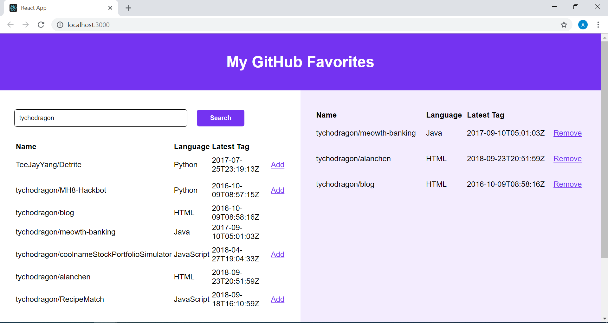

Shopify Web-Challenge

Alan Chen

My screenshot:

This was built using React, Redux, including Fetch to make the GraphQL API calls to Github API.

Normally, I would not leave my API authentication token in the code, but to save the trouble
of creating one on your own, you may use it on this occasion. Note that if the token does not work,
you may have to create one on your own. If you do create one, go to `./api_token.js` and replace the
existing value of `API_TOKEN` with your key.

Enjoy!

How to run:
1. Clone this repository
2. Run the command `npm install` to install dependencies
3. Run the command `npm run start`
4. The react application should be running on localhost:3000

